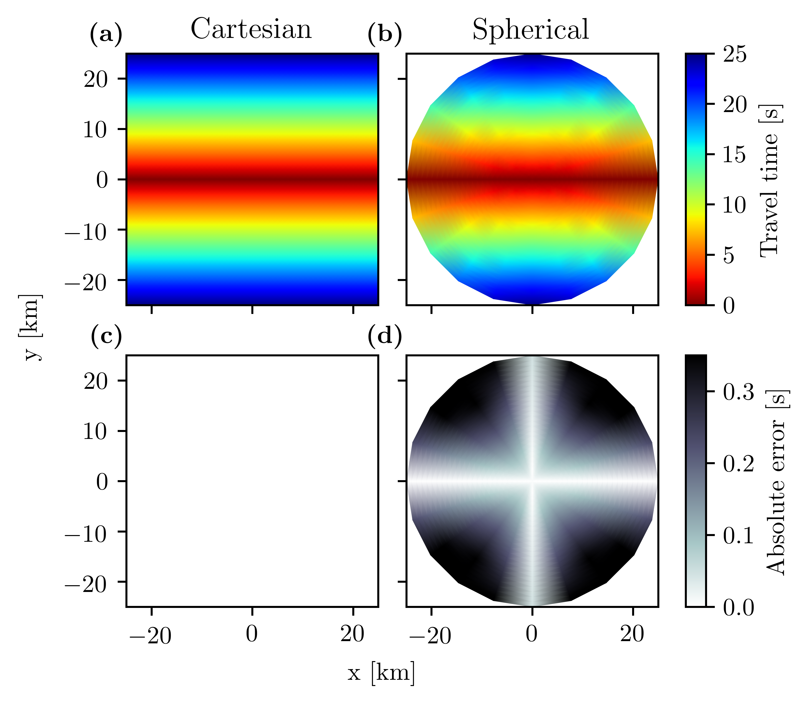
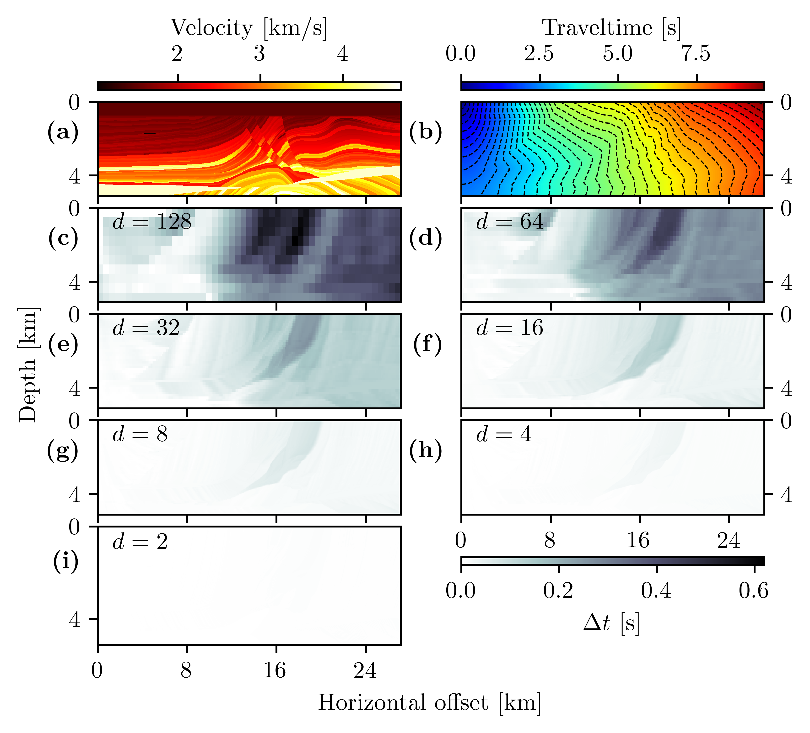
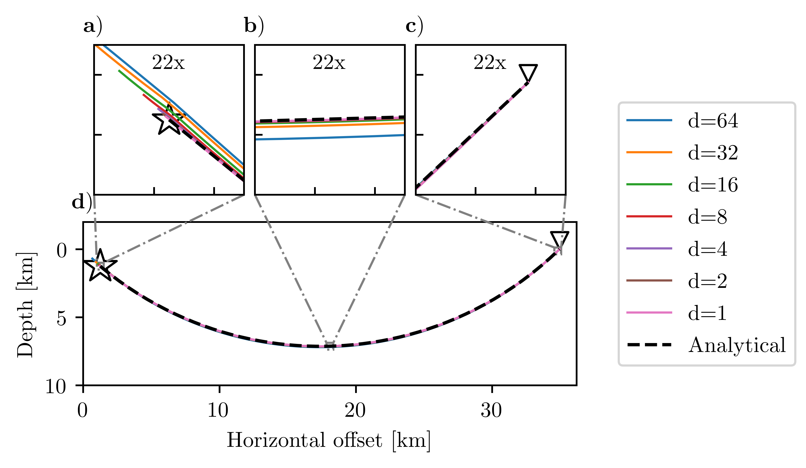
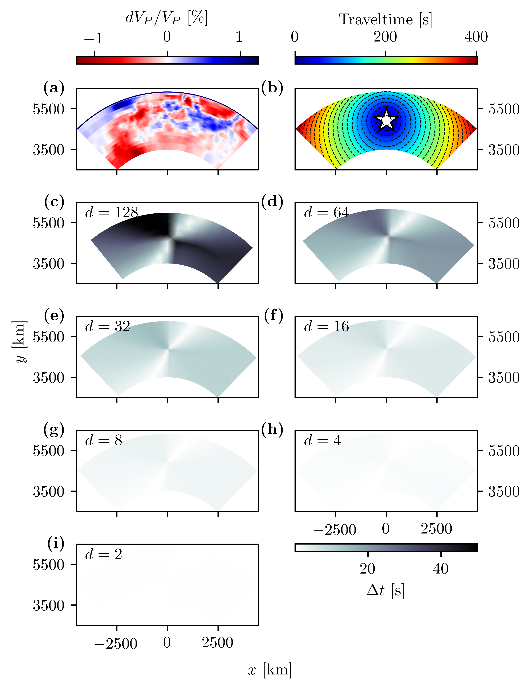
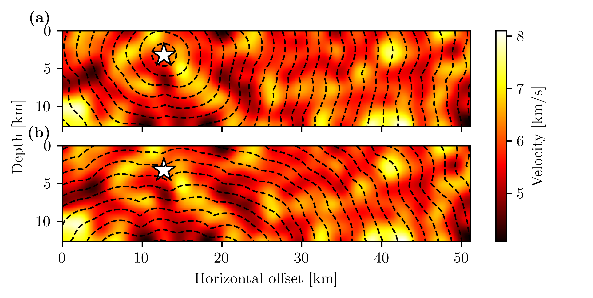

Jupyter Notebooks
=================

After installing PyKonal, the Jupyter Notebooks here can be used to reproduce
the figures from White et al. (2020).

.. :download:`Figure 3 <jupyter/figure_3.ipynb>`

Download
--------
* figure_3.ipynb
* figure_4.ipynb
* figure_5.ipynb
* figure_6.ipynb
* figure_7.ipynb
* figure_8.ipynb

Figure 3
--------
.. image:: figures/jupyter/figure_3.png
   :align: center

Figure 4
--------

Figure 5
--------

Figure 6
--------

Figure 7
--------

Figure 8
--------

