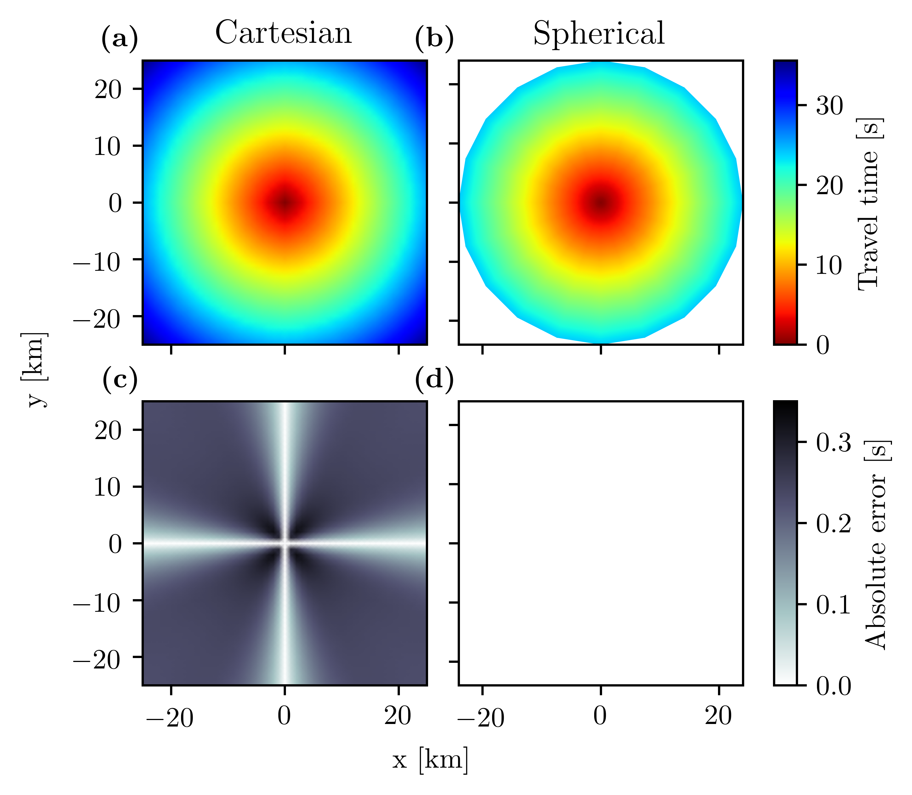
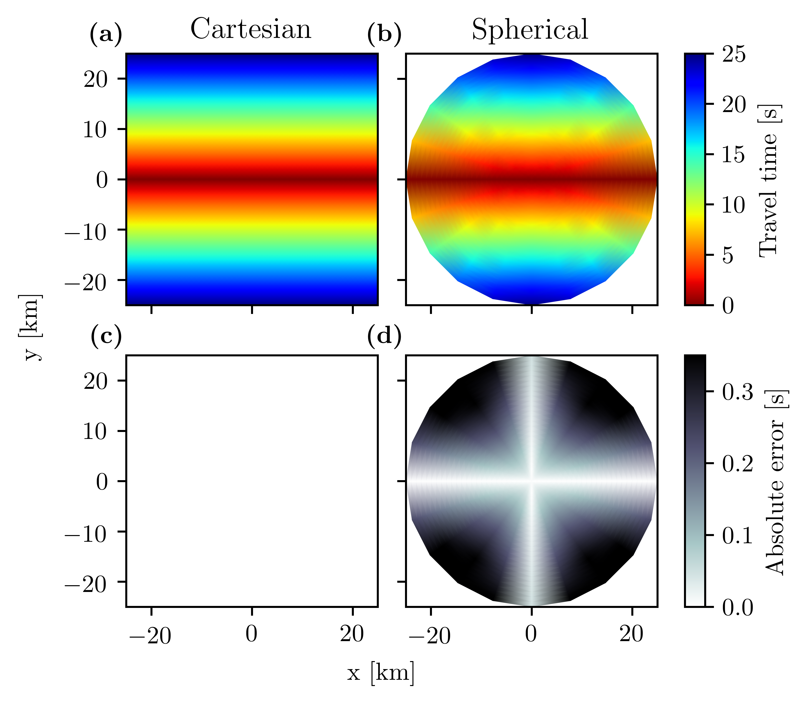
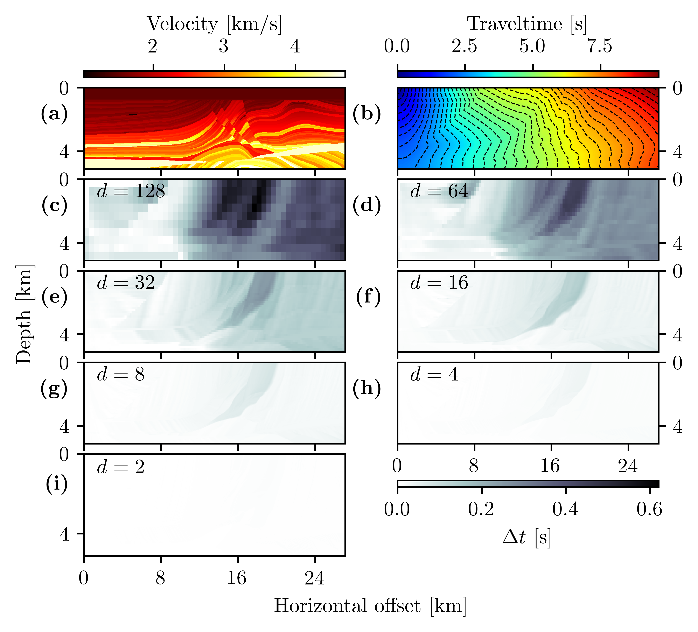
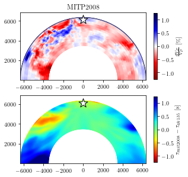

Jupyter Notebooks
=================

The Jupyter Notebooks here can be used to reproduce the figures from White et al. (2020).

:download:`Point source accuracy <jupyter/point_source_accuracy.ipynb>`

Point source accuracy
---------------------

Line source accuracy
--------------------

Marmousi2 stability
--------------------

Ray-tracing stability
---------------------
.. image:: figures/jupyter/ray_tracing_accuracy.png

Global stability
----------------

Reflected waves
---------------
.. image:: figures/jupyter/reflected_waves.png
